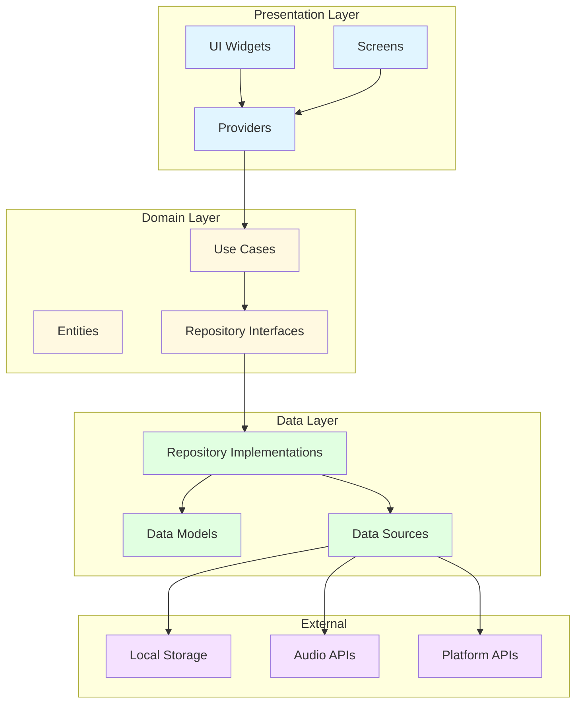
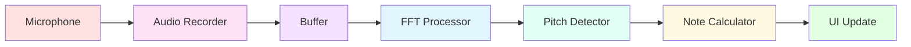
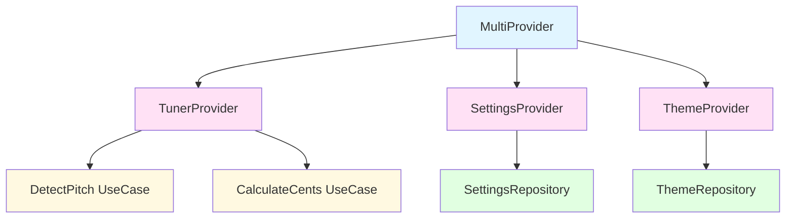

# Architecture - Guitar Tuna

## 📋 Tổng Quan

Guitar Tuna được xây dựng dựa trên **Clean Architecture** kết hợp với **Provider** pattern cho state management. Kiến trúc này đảm bảo:
- ✅ **Separation of Concerns**: Tách biệt rõ ràng giữa các layers
- ✅ **Testability**: Dễ dàng test từng component độc lập
- ✅ **Maintainability**: Dễ bảo trì và mở rộng
- ✅ **Scalability**: Có thể scale khi app phát triển
- ✅ **Independence**: Các layer độc lập với nhau

---

## 🏛️ Clean Architecture Layers



---

## 📦 Layer Details

### 1. Presentation Layer
**Responsibility**: UI và user interaction

#### Components:
- **Screens**: Các màn hình của app
- **Widgets**: UI components
- **Providers**: State management

#### Dependencies:
- ✅ Phụ thuộc vào: Domain Layer
- ❌ Không phụ thuộc vào: Data Layer

#### Example:
```dart
// presentation/providers/tuner_provider.dart
class TunerProvider extends ChangeNotifier {
  final DetectPitch _detectPitch;
  final CalculateCents _calculateCents;
  
  TunerProvider({
    required DetectPitch detectPitch,
    required CalculateCents calculateCents,
  })  : _detectPitch = detectPitch,
        _calculateCents = calculateCents;
  
  Note? _currentNote;
  double _cents = 0.0;
  bool _isListening = false;
  
  Note? get currentNote => _currentNote;
  double get cents => _cents;
  bool get isListening => _isListening;
  
  Future<void> startListening() async {
    _isListening = true;
    notifyListeners();
    
    // Use domain use case
    await _detectPitch.execute(
      onPitchDetected: (frequency) {
        _updateNote(frequency);
      },
    );
  }
  
  void _updateNote(double frequency) {
    final result = _detectPitch.getNote(frequency);
    result.fold(
      (failure) => _handleError(failure),
      (note) {
        _currentNote = note;
        _cents = _calculateCents.execute(frequency, note.frequency);
        notifyListeners();
      },
    );
  }
}
```

---

### 2. Domain Layer
**Responsibility**: Business logic thuần túy

#### Components:
- **Entities**: Business objects
- **Repository Interfaces**: Contracts cho data access
- **Use Cases**: Business operations

#### Dependencies:
- ✅ Không phụ thuộc vào layer nào
- ✅ Là core của application

#### Example:
```dart
// domain/entities/note.dart
class Note extends Equatable {
  final String name;
  final int octave;
  final double frequency;
  final int midiNumber;
  
  const Note({
    required this.name,
    required this.octave,
    required this.frequency,
    required this.midiNumber,
  });
  
  bool get isNatural => !name.contains('#') && !name.contains('b');
  
  @override
  List<Object?> get props => [name, octave, frequency, midiNumber];
}

// domain/repositories/audio_repository.dart
abstract class AudioRepository {
  Future<Either<Failure, Stream<double>>> startPitchDetection();
  Future<Either<Failure, void>> stopPitchDetection();
  Future<Either<Failure, bool>> checkMicrophonePermission();
  Future<Either<Failure, bool>> requestMicrophonePermission();
}

// domain/usecases/detect_pitch.dart
class DetectPitch {
  final AudioRepository repository;
  
  DetectPitch(this.repository);
  
  Future<Either<Failure, Stream<double>>> execute() {
    return repository.startPitchDetection();
  }
  
  Either<Failure, Note> getNote(double frequency) {
    try {
      // Calculate MIDI note number from frequency
      final midiNumber = _frequencyToMidi(frequency);
      final noteName = _midiToNoteName(midiNumber);
      final octave = _midiToOctave(midiNumber);
      final exactFrequency = _midiToFrequency(midiNumber);
      
      return Right(Note(
        name: noteName,
        octave: octave,
        frequency: exactFrequency,
        midiNumber: midiNumber,
      ));
    } catch (e) {
      return Left(PitchDetectionFailure(e.toString()));
    }
  }
  
  int _frequencyToMidi(double frequency) {
    return (12 * (log(frequency / 440) / log(2)) + 69).round();
  }
  
  String _midiToNoteName(int midi) {
    const notes = ['C', 'C#', 'D', 'D#', 'E', 'F', 
                   'F#', 'G', 'G#', 'A', 'A#', 'B'];
    return notes[midi % 12];
  }
  
  int _midiToOctave(int midi) {
    return (midi / 12).floor() - 1;
  }
  
  double _midiToFrequency(int midi) {
    return 440 * pow(2, (midi - 69) / 12);
  }
}
```

---

### 3. Data Layer
**Responsibility**: Data access và persistence

#### Components:
- **Repository Implementations**: Implement repository interfaces
- **Data Models**: Data transfer objects
- **Data Sources**: Local/Remote data access

#### Dependencies:
- ✅ Phụ thuộc vào: Domain Layer (interfaces)
- ✅ Phụ thuộc vào: External libraries

#### Example:
```dart
// data/models/note_model.dart
class NoteModel extends Note {
  const NoteModel({
    required super.name,
    required super.octave,
    required super.frequency,
    required super.midiNumber,
  });
  
  factory NoteModel.fromJson(Map<String, dynamic> json) {
    return NoteModel(
      name: json['name'] as String,
      octave: json['octave'] as int,
      frequency: json['frequency'] as double,
      midiNumber: json['midiNumber'] as int,
    );
  }
  
  Map<String, dynamic> toJson() {
    return {
      'name': name,
      'octave': octave,
      'frequency': frequency,
      'midiNumber': midiNumber,
    };
  }
  
  factory NoteModel.fromEntity(Note note) {
    return NoteModel(
      name: note.name,
      octave: note.octave,
      frequency: note.frequency,
      midiNumber: note.midiNumber,
    );
  }
}

// data/repositories/audio_repository_impl.dart
class AudioRepositoryImpl implements AudioRepository {
  final AudioService audioService;
  final PermissionService permissionService;
  
  AudioRepositoryImpl({
    required this.audioService,
    required this.permissionService,
  });
  
  @override
  Future<Either<Failure, Stream<double>>> startPitchDetection() async {
    try {
      final hasPermission = await permissionService.hasMicrophonePermission();
      
      if (!hasPermission) {
        return Left(PermissionFailure('Microphone permission denied'));
      }
      
      final stream = await audioService.startRecording();
      return Right(stream);
    } on AudioException catch (e) {
      return Left(AudioFailure(e.message));
    } catch (e) {
      return Left(UnexpectedFailure(e.toString()));
    }
  }
  
  @override
  Future<Either<Failure, void>> stopPitchDetection() async {
    try {
      await audioService.stopRecording();
      return const Right(null);
    } catch (e) {
      return Left(AudioFailure(e.toString()));
    }
  }
  
  @override
  Future<Either<Failure, bool>> checkMicrophonePermission() async {
    try {
      final hasPermission = await permissionService.hasMicrophonePermission();
      return Right(hasPermission);
    } catch (e) {
      return Left(PermissionFailure(e.toString()));
    }
  }
  
  @override
  Future<Either<Failure, bool>> requestMicrophonePermission() async {
    try {
      final granted = await permissionService.requestMicrophonePermission();
      return Right(granted);
    } catch (e) {
      return Left(PermissionFailure(e.toString()));
    }
  }
}
```

---

## 🎵 Audio Processing Architecture

### Audio Pipeline


### Audio Service Architecture
```dart
// services/audio/audio_service.dart
class AudioService {
  final AudioRecorder _recorder;
  final FFTProcessor _fftProcessor;
  final PitchDetector _pitchDetector;
  
  StreamController<double>? _frequencyController;
  
  AudioService({
    required AudioRecorder recorder,
    required FFTProcessor fftProcessor,
    required PitchDetector pitchDetector,
  })  : _recorder = recorder,
        _fftProcessor = fftProcessor,
        _pitchDetector = pitchDetector;
  
  Future<Stream<double>> startRecording() async {
    _frequencyController = StreamController<double>.broadcast();
    
    final audioStream = await _recorder.start();
    
    audioStream.listen((audioData) {
      _processAudioData(audioData);
    });
    
    return _frequencyController!.stream;
  }
  
  void _processAudioData(List<double> audioData) {
    // 1. Apply windowing function
    final windowedData = _applyWindow(audioData);
    
    // 2. Perform FFT
    final fftResult = _fftProcessor.process(windowedData);
    
    // 3. Detect pitch
    final frequency = _pitchDetector.detectPitch(fftResult);
    
    // 4. Emit frequency
    if (frequency != null && frequency > 0) {
      _frequencyController?.add(frequency);
    }
  }
  
  List<double> _applyWindow(List<double> data) {
    // Apply Hann window
    final n = data.length;
    return List.generate(n, (i) {
      final window = 0.5 * (1 - cos(2 * pi * i / (n - 1)));
      return data[i] * window;
    });
  }
  
  Future<void> stopRecording() async {
    await _recorder.stop();
    await _frequencyController?.close();
    _frequencyController = null;
  }
  
  void dispose() {
    _recorder.dispose();
    _frequencyController?.close();
  }
}

// services/audio/fft_processor.dart
class FFTProcessor {
  final int _fftSize;
  final double _sampleRate;
  
  FFTProcessor({
    int fftSize = 4096,
    double sampleRate = 44100,
  })  : _fftSize = fftSize,
        _sampleRate = sampleRate;
  
  List<double> process(List<double> audioData) {
    // Ensure data length matches FFT size
    final paddedData = _padData(audioData);
    
    // Perform FFT
    final fft = FFT(_fftSize);
    final complexResult = fft.realFft(paddedData);
    
    // Calculate magnitude spectrum
    final magnitude = List.generate(
      _fftSize ~/ 2,
      (i) => sqrt(
        complexResult[i].real * complexResult[i].real +
        complexResult[i].imaginary * complexResult[i].imaginary,
      ),
    );
    
    return magnitude;
  }
  
  List<double> _padData(List<double> data) {
    if (data.length >= _fftSize) {
      return data.sublist(0, _fftSize);
    }
    
    return [
      ...data,
      ...List.filled(_fftSize - data.length, 0.0),
    ];
  }
  
  double frequencyFromBin(int bin) {
    return bin * _sampleRate / _fftSize;
  }
}

// services/audio/pitch_detector.dart
class PitchDetector {
  final double _sampleRate;
  final int _fftSize;
  final double _minFrequency;
  final double _maxFrequency;
  
  PitchDetector({
    double sampleRate = 44100,
    int fftSize = 4096,
    double minFrequency = 80.0,  // E2
    double maxFrequency = 1200.0, // D6
  })  : _sampleRate = sampleRate,
        _fftSize = fftSize,
        _minFrequency = minFrequency,
        _maxFrequency = maxFrequency;
  
  double? detectPitch(List<double> magnitudeSpectrum) {
    // Find peak in magnitude spectrum
    final minBin = _frequencyToBin(_minFrequency);
    final maxBin = _frequencyToBin(_maxFrequency);
    
    double maxMagnitude = 0;
    int peakBin = 0;
    
    for (int i = minBin; i < maxBin && i < magnitudeSpectrum.length; i++) {
      if (magnitudeSpectrum[i] > maxMagnitude) {
        maxMagnitude = magnitudeSpectrum[i];
        peakBin = i;
      }
    }
    
    // Threshold check
    if (maxMagnitude < 0.01) {
      return null; // Signal too weak
    }
    
    // Parabolic interpolation for better accuracy
    final frequency = _parabolicInterpolation(
      magnitudeSpectrum,
      peakBin,
    );
    
    return frequency;
  }
  
  int _frequencyToBin(double frequency) {
    return (frequency * _fftSize / _sampleRate).round();
  }
  
  double _binToFrequency(double bin) {
    return bin * _sampleRate / _fftSize;
  }
  
  double _parabolicInterpolation(List<double> spectrum, int peakBin) {
    if (peakBin <= 0 || peakBin >= spectrum.length - 1) {
      return _binToFrequency(peakBin.toDouble());
    }
    
    final alpha = spectrum[peakBin - 1];
    final beta = spectrum[peakBin];
    final gamma = spectrum[peakBin + 1];
    
    final p = 0.5 * (alpha - gamma) / (alpha - 2 * beta + gamma);
    final interpolatedBin = peakBin + p;
    
    return _binToFrequency(interpolatedBin);
  }
}
```

---

## 🔄 State Management with Provider

### Provider Architecture


### Provider Setup
```dart
// main.dart
void main() async {
  WidgetsFlutterBinding.ensureInitialized();
  
  // Initialize dependencies
  final serviceLocator = ServiceLocator();
  await serviceLocator.init();
  
  runApp(
    MultiProvider(
      providers: [
        ChangeNotifierProvider(
          create: (_) => TunerProvider(
            detectPitch: serviceLocator.get<DetectPitch>(),
            calculateCents: serviceLocator.get<CalculateCents>(),
            audioRepository: serviceLocator.get<AudioRepository>(),
          ),
        ),
        ChangeNotifierProvider(
          create: (_) => SettingsProvider(
            getSettings: serviceLocator.get<GetSettings>(),
            saveSettings: serviceLocator.get<SaveSettings>(),
          ),
        ),
        ChangeNotifierProvider(
          create: (_) => ThemeProvider(
            getTheme: serviceLocator.get<GetTheme>(),
            saveTheme: serviceLocator.get<SaveTheme>(),
          ),
        ),
      ],
      child: const MyApp(),
    ),
  );
}
```

---

## 🔌 Dependency Injection

### Service Locator Pattern
```dart
// core/di/service_locator.dart
class ServiceLocator {
  static final ServiceLocator _instance = ServiceLocator._internal();
  factory ServiceLocator() => _instance;
  ServiceLocator._internal();
  
  final GetIt _getIt = GetIt.instance;
  
  Future<void> init() async {
    // External
    final sharedPreferences = await SharedPreferences.getInstance();
    _getIt.registerSingleton<SharedPreferences>(sharedPreferences);
    
    // Services
    _getIt.registerLazySingleton<AudioRecorder>(
      () => AudioRecorderImpl(),
    );
    _getIt.registerLazySingleton<FFTProcessor>(
      () => FFTProcessor(),
    );
    _getIt.registerLazySingleton<PitchDetector>(
      () => PitchDetector(),
    );
    _getIt.registerLazySingleton<AudioService>(
      () => AudioService(
        recorder: _getIt<AudioRecorder>(),
        fftProcessor: _getIt<FFTProcessor>(),
        pitchDetector: _getIt<PitchDetector>(),
      ),
    );
    _getIt.registerLazySingleton<PermissionService>(
      () => PermissionServiceImpl(),
    );
    
    // Data Sources
    _getIt.registerLazySingleton<LocalDataSource>(
      () => LocalDataSourceImpl(_getIt<SharedPreferences>()),
    );
    
    // Repositories
    _getIt.registerLazySingleton<AudioRepository>(
      () => AudioRepositoryImpl(
        audioService: _getIt<AudioService>(),
        permissionService: _getIt<PermissionService>(),
      ),
    );
    _getIt.registerLazySingleton<SettingsRepository>(
      () => SettingsRepositoryImpl(
        localDataSource: _getIt<LocalDataSource>(),
      ),
    );
    
    // Use Cases
    _getIt.registerLazySingleton(
      () => DetectPitch(_getIt<AudioRepository>()),
    );
    _getIt.registerLazySingleton(
      () => CalculateCents(),
    );
    _getIt.registerLazySingleton(
      () => GetSettings(_getIt<SettingsRepository>()),
    );
    _getIt.registerLazySingleton(
      () => SaveSettings(_getIt<SettingsRepository>()),
    );
  }
  
  T get<T extends Object>() => _getIt<T>();
}
```

---

## 🎯 Key Design Patterns

### 1. Repository Pattern
Abstraction layer giữa data sources và business logic.

### 2. Use Case Pattern
Mỗi use case đại diện cho một business operation.

### 3. Provider Pattern
State management và dependency injection.

### 4. Factory Pattern
Tạo objects với logic phức tạp.

### 5. Singleton Pattern
Shared instances (services, repositories).

---

## 📊 Data Flow Example

### Tuning Flow
```
User opens Tuner Screen
    ↓
TunerProvider.startListening()
    ↓
DetectPitch.execute()
    ↓
AudioRepository.startPitchDetection()
    ↓
AudioService.startRecording()
    ↓
Audio data → FFT → Pitch Detection
    ↓
Frequency detected
    ↓
TunerProvider receives frequency
    ↓
CalculateCents.execute()
    ↓
TunerProvider updates state
    ↓
UI rebuilds with new note & cents
```

---

## 🧪 Testing Strategy

### Unit Tests
- Test use cases
- Test repositories
- Test services
- Test utils

### Widget Tests
- Test individual widgets
- Test widget interactions
- Test UI state changes

### Integration Tests
- Test complete user flows
- Test audio pipeline
- Test settings persistence

---

## 📈 Performance Considerations

### Audio Processing
- Process audio trong isolate
- Use efficient FFT algorithms
- Optimize buffer sizes
- Minimize memory allocations

### UI Performance
- Use const constructors
- Avoid unnecessary rebuilds
- Optimize widget tree
- Use RepaintBoundary

### State Management
- Only notify when necessary
- Use Selector for specific updates
- Dispose resources properly

---

## 🔒 Security & Privacy

### Permissions
- Request only necessary permissions
- Explain permission usage
- Handle denied permissions gracefully

### Data Privacy
- No data collection without consent
- Local-first approach
- Clear data on uninstall

---

## 📚 References

- [Clean Architecture by Uncle Bob](https://blog.cleancoder.com/uncle-bob/2012/08/13/the-clean-architecture.html)
- [Flutter Provider](https://pub.dev/packages/provider)
- [Dependency Injection in Flutter](https://pub.dev/packages/get_it)
- [Audio Processing in Flutter](https://pub.dev/packages/flutter_sound)

---

**Last Updated**: 2025-12-31
**Version**: 1.0.0
