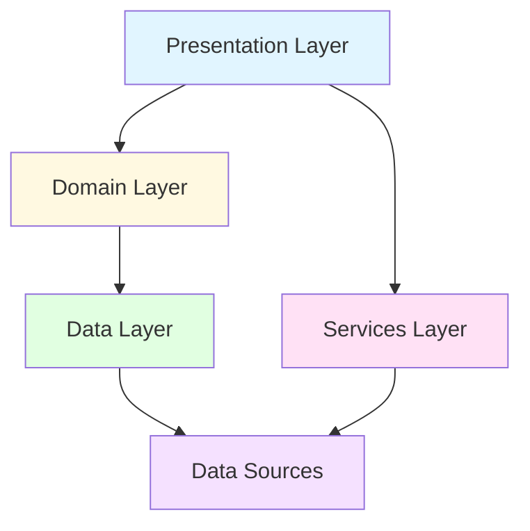

# Project Structure - Guitar Tuna

## 📋 Tổng Quan

Guitar Tuna là ứng dụng tuner đàn guitar được xây dựng với Flutter, sử dụng kiến trúc **Clean Architecture** kết hợp với **Provider** cho state management.

---

## 🏗️ Cấu Trúc Thư Mục

```
guitar_tuna/
├── android/                    # Android native code
├── ios/                        # iOS native code
├── linux/                      # Linux desktop support
├── macos/                      # macOS desktop support
├── web/                        # Web support
├── windows/                    # Windows desktop support
├── lib/                        # Main source code
│   ├── main.dart              # Entry point
│   ├── app.dart               # App configuration
│   │
│   ├── core/                  # Core functionality
│   │   ├── constants/         # App constants
│   │   │   ├── app_constants.dart
│   │   │   ├── audio_constants.dart
│   │   │   └── ui_constants.dart
│   │   │
│   │   ├── theme/             # App theming
│   │   │   ├── app_theme.dart
│   │   │   ├── colors.dart
│   │   │   ├── text_styles.dart
│   │   │   └── dimensions.dart
│   │   │
│   │   ├── utils/             # Utility functions
│   │   │   ├── audio_utils.dart
│   │   │   ├── math_utils.dart
│   │   │   ├── logger.dart
│   │   │   └── validators.dart
│   │   │
│   │   ├── errors/            # Error handling
│   │   │   ├── exceptions.dart
│   │   │   └── failures.dart
│   │   │
│   │   └── extensions/        # Dart extensions
│   │       ├── string_extension.dart
│   │       ├── double_extension.dart
│   │       └── context_extension.dart
│   │
│   ├── data/                  # Data layer
│   │   ├── models/            # Data models
│   │   │   ├── note_model.dart
│   │   │   ├── tuning_model.dart
│   │   │   └── settings_model.dart
│   │   │
│   │   ├── repositories/      # Repository implementations
│   │   │   ├── audio_repository_impl.dart
│   │   │   ├── settings_repository_impl.dart
│   │   │   └── tuning_repository_impl.dart
│   │   │
│   │   └── datasources/       # Data sources
│   │       ├── local/         # Local data sources
│   │       │   ├── shared_preferences_service.dart
│   │       │   └── hive_service.dart
│   │       │
│   │       └── remote/        # Remote data sources (if needed)
│   │           └── api_service.dart
│   │
│   ├── domain/                # Domain layer (Business logic)
│   │   ├── entities/          # Business entities
│   │   │   ├── note.dart
│   │   │   ├── tuning.dart
│   │   │   └── settings.dart
│   │   │
│   │   ├── repositories/      # Repository interfaces
│   │   │   ├── audio_repository.dart
│   │   │   ├── settings_repository.dart
│   │   │   └── tuning_repository.dart
│   │   │
│   │   └── usecases/          # Use cases
│   │       ├── detect_pitch.dart
│   │       ├── calculate_cents.dart
│   │       ├── get_tuning.dart
│   │       └── save_settings.dart
│   │
│   ├── presentation/          # Presentation layer
│   │   ├── providers/         # State management
│   │   │   ├── tuner_provider.dart
│   │   │   ├── settings_provider.dart
│   │   │   └── theme_provider.dart
│   │   │
│   │   ├── screens/           # App screens
│   │   │   ├── home/
│   │   │   │   ├── home_screen.dart
│   │   │   │   └── widgets/
│   │   │   │       ├── tuner_display.dart
│   │   │   │       ├── frequency_meter.dart
│   │   │   │       └── note_indicator.dart
│   │   │   │
│   │   │   ├── tuner/
│   │   │   │   ├── tuner_screen.dart
│   │   │   │   └── widgets/
│   │   │   │       ├── pitch_detector.dart
│   │   │   │       ├── tuning_needle.dart
│   │   │   │       ├── cents_display.dart
│   │   │   │       └── string_selector.dart
│   │   │   │
│   │   │   ├── settings/
│   │   │   │   ├── settings_screen.dart
│   │   │   │   └── widgets/
│   │   │   │       ├── tuning_selector.dart
│   │   │   │       ├── theme_selector.dart
│   │   │   │       └── calibration_settings.dart
│   │   │   │
│   │   │   └── about/
│   │   │       └── about_screen.dart
│   │   │
│   │   ├── widgets/           # Shared widgets
│   │   │   ├── common/
│   │   │   │   ├── custom_button.dart
│   │   │   │   ├── custom_card.dart
│   │   │   │   ├── loading_indicator.dart
│   │   │   │   └── error_widget.dart
│   │   │   │
│   │   │   ├── audio/
│   │   │   │   ├── waveform_visualizer.dart
│   │   │   │   ├── spectrum_analyzer.dart
│   │   │   │   └── audio_level_meter.dart
│   │   │   │
│   │   │   └── tuner/
│   │   │       ├── circular_tuner.dart
│   │   │       ├── linear_tuner.dart
│   │   │       └── strobe_tuner.dart
│   │   │
│   │   └── navigation/        # Navigation
│   │       ├── app_router.dart
│   │       └── routes.dart
│   │
│   └── services/              # Services
│       ├── audio/             # Audio processing
│       │   ├── audio_service.dart
│       │   ├── pitch_detector.dart
│       │   ├── fft_processor.dart
│       │   └── audio_recorder.dart
│       │
│       ├── permission/        # Permission handling
│       │   └── permission_service.dart
│       │
│       └── analytics/         # Analytics (optional)
│           └── analytics_service.dart
│
├── test/                      # Tests
│   ├── unit/                  # Unit tests
│   │   ├── domain/
│   │   │   └── usecases/
│   │   ├── data/
│   │   │   └── repositories/
│   │   └── services/
│   │
│   ├── widget/                # Widget tests
│   │   └── presentation/
│   │       └── widgets/
│   │
│   └── integration/           # Integration tests
│       └── app_test.dart
│
├── assets/                    # Assets
│   ├── images/               # Images
│   │   ├── logo.png
│   │   └── icons/
│   │
│   ├── fonts/                # Custom fonts
│   │   └── Roboto/
│   │
│   └── audio/                # Audio files (if needed)
│       └── reference_tones/
│
├── docs/                     # Documentation
│   ├── work_rules.md
│   ├── project_structure.md
│   ├── architecture.md
│   ├── api.md
│   └── setup.md
│
├── scripts/                  # Build scripts
│   ├── build_android.sh
│   └── build_ios.sh
│
├── .github/                  # GitHub configs
│   └── workflows/
│       ├── ci.yml
│       └── release.yml
│
├── pubspec.yaml             # Dependencies
├── analysis_options.yaml    # Linter rules
├── README.md
├── CHANGELOG.md
└── .gitignore
```

---

## 📦 Layer Responsibilities

### 1. **Core Layer** (`lib/core/`)
Chứa các thành phần dùng chung cho toàn bộ app:
- **Constants**: Các hằng số (màu sắc, kích thước, audio configs)
- **Theme**: Theme configuration, colors, text styles
- **Utils**: Utility functions, helpers
- **Errors**: Exception và failure classes
- **Extensions**: Dart extensions

### 2. **Data Layer** (`lib/data/`)
Xử lý data từ các nguồn khác nhau:
- **Models**: Data models (JSON serialization)
- **Repositories**: Implementation của repository interfaces
- **Datasources**: Local (SharedPreferences, Hive) và Remote (API)

### 3. **Domain Layer** (`lib/domain/`)
Business logic của app:
- **Entities**: Pure business objects
- **Repositories**: Repository interfaces (contracts)
- **Usecases**: Business use cases (một class cho một action)

### 4. **Presentation Layer** (`lib/presentation/`)
UI và state management:
- **Providers**: State management với Provider
- **Screens**: Các màn hình của app
- **Widgets**: Reusable UI components
- **Navigation**: Routing configuration

### 5. **Services Layer** (`lib/services/`)
External services:
- **Audio**: Audio processing, FFT, pitch detection
- **Permission**: Permission handling
- **Analytics**: Analytics tracking (optional)

---

## 🎯 Key Components

### Audio Processing Flow
```
Microphone Input
    ↓
AudioRecorder (captures raw audio)
    ↓
FFTProcessor (performs FFT)
    ↓
PitchDetector (detects fundamental frequency)
    ↓
TunerProvider (calculates note & cents)
    ↓
UI Update (displays result)
```

### State Management Flow
```
User Action
    ↓
Provider Method Call
    ↓
UseCase Execution
    ↓
Repository Call
    ↓
DataSource Operation
    ↓
Provider State Update
    ↓
UI Rebuild
```

---

## 📱 Screen Structure

### 1. Home Screen
- **Purpose**: Main navigation hub
- **Features**:
  - Quick access to tuner
  - Recent tunings
  - Settings shortcut

### 2. Tuner Screen
- **Purpose**: Main tuning interface
- **Features**:
  - Real-time pitch detection
  - Visual tuning indicator
  - Cents offset display
  - String selector (for guitar)
  - Tuning mode selector

### 3. Settings Screen
- **Purpose**: App configuration
- **Features**:
  - Tuning selection (Standard, Drop D, etc.)
  - Reference pitch (A4 = 440Hz)
  - Theme selection
  - Calibration options
  - Audio settings

### 4. About Screen
- **Purpose**: App information
- **Features**:
  - Version info
  - Credits
  - Help & FAQ
  - Privacy policy

---

## 🔧 Configuration Files

### `pubspec.yaml`
```yaml
name: guitar_tuna
description: Professional guitar tuner app
version: 1.0.0+1

environment:
  sdk: ^3.9.2

dependencies:
  flutter:
    sdk: flutter
  
  # State Management
  provider: ^6.1.1
  
  # Audio Processing
  flutter_sound: ^9.2.13
  fft: ^2.0.0
  
  # Local Storage
  shared_preferences: ^2.2.2
  hive: ^2.2.3
  hive_flutter: ^1.1.0
  
  # Permissions
  permission_handler: ^11.1.0
  
  # UI
  flutter_svg: ^2.0.9
  google_fonts: ^6.1.0
  
  # Utils
  equatable: ^2.0.5
  dartz: ^0.10.1

dev_dependencies:
  flutter_test:
    sdk: flutter
  flutter_lints: ^5.0.0
  mockito: ^5.4.4
  build_runner: ^2.4.7
```

### `analysis_options.yaml`
```yaml
include: package:flutter_lints/flutter.yaml

linter:
  rules:
    - always_declare_return_types
    - always_put_required_named_parameters_first
    - avoid_print
    - avoid_unnecessary_containers
    - prefer_const_constructors
    - prefer_const_literals_to_create_immutables
    - prefer_final_fields
    - prefer_single_quotes
    - require_trailing_commas
    - sort_child_properties_last
    - use_key_in_widget_constructors
```

---

## 🎨 Asset Organization

### Images
```
assets/images/
├── logo/
│   ├── logo.png
│   ├── logo@2x.png
│   └── logo@3x.png
├── icons/
│   ├── guitar.svg
│   ├── settings.svg
│   └── info.svg
└── backgrounds/
    ├── gradient_bg.png
    └── pattern_bg.png
```

### Fonts
```
assets/fonts/
├── Roboto/
│   ├── Roboto-Regular.ttf
│   ├── Roboto-Medium.ttf
│   └── Roboto-Bold.ttf
└── Montserrat/
    ├── Montserrat-Regular.ttf
    └── Montserrat-Bold.ttf
```

---

## 🧪 Testing Structure

### Unit Tests
```
test/unit/
├── domain/usecases/
│   ├── detect_pitch_test.dart
│   └── calculate_cents_test.dart
├── data/repositories/
│   └── audio_repository_impl_test.dart
└── services/
    ├── audio_service_test.dart
    └── pitch_detector_test.dart
```

### Widget Tests
```
test/widget/
└── presentation/
    ├── screens/
    │   └── tuner_screen_test.dart
    └── widgets/
        ├── tuning_needle_test.dart
        └── frequency_meter_test.dart
```

### Integration Tests
```
test/integration/
├── tuner_flow_test.dart
└── settings_flow_test.dart
```

---

## 📊 Data Models

### Note Model
```dart
class NoteModel {
  final String name;        // 'A', 'B', 'C', etc.
  final int octave;         // 0-8
  final double frequency;   // Hz
  final double cents;       // -50 to +50
  final bool isInTune;      // Within threshold
}
```

### Tuning Model
```dart
class TuningModel {
  final String id;
  final String name;        // 'Standard', 'Drop D', etc.
  final List<String> notes; // ['E', 'A', 'D', 'G', 'B', 'E']
  final List<double> frequencies;
}
```

### Settings Model
```dart
class SettingsModel {
  final String tuningId;
  final double referencePitch;  // A4 frequency (default 440Hz)
  final String theme;           // 'light', 'dark', 'auto'
  final double sensitivity;     // 0.0 - 1.0
  final bool autoMode;          // Auto detect string
}
```

---

## 🚀 Build & Deployment

### Development
```bash
# Run in debug mode
flutter run

# Run with specific device
flutter run -d chrome
flutter run -d android
flutter run -d ios
```

### Testing
```bash
# Run all tests
flutter test

# Run with coverage
flutter test --coverage

# Run specific test
flutter test test/unit/services/audio_service_test.dart
```

### Build
```bash
# Android
flutter build apk --release
flutter build appbundle --release

# iOS
flutter build ios --release

# Web
flutter build web --release
```

---

## 📝 Naming Conventions Summary

| Type | Convention | Example |
|------|------------|---------|
| Files | snake_case | `audio_service.dart` |
| Classes | PascalCase | `AudioService` |
| Variables | camelCase | `currentFrequency` |
| Constants | SCREAMING_SNAKE_CASE | `MAX_FREQUENCY` |
| Private | _prefix | `_privateMethod()` |
| Screens | PascalCase + Screen | `TunerScreen` |
| Widgets | PascalCase | `FrequencyMeter` |
| Providers | PascalCase + Provider | `TunerProvider` |

---

## 🔗 Dependencies Graph



---

## 📚 Additional Resources

### Documentation Files
- **work_rules.md**: Coding standards và quy tắc làm việc
- **architecture.md**: Chi tiết về kiến trúc hệ thống
- **setup.md**: Hướng dẫn setup môi trường development
- **api.md**: API documentation (nếu có backend)

### External Links
- [Flutter Documentation](https://docs.flutter.dev/)
- [Provider Package](https://pub.dev/packages/provider)
- [Flutter Sound](https://pub.dev/packages/flutter_sound)
- [Clean Architecture](https://blog.cleancoder.com/uncle-bob/2012/08/13/the-clean-architecture.html)

---

**Last Updated**: 2025-12-31
**Version**: 1.0.0
